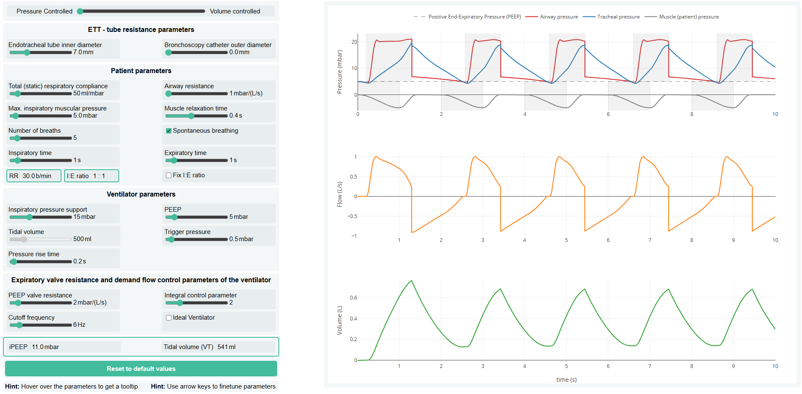

# Bronchoscopy
Numerical simulation tool for predicting the impact of bronchoscopy on ventilation, supporting clinical decision-making by guiding ventilator settings to reduce dynamic hyperinflation and hypoventilation. Includes Python script and a browser-based interface.

<a href="https://johannes-bartl.github.io/ventilation/" target="_blank">
  
</a>

## Abstract

Bronchoscopy in mechanically ventilated patients is performed by passing a bronchoscope through the endotracheal tube (ETT), which substantially increases airflow resistance and may compromise ventilation. Here, we quantify the nonlinear, flow-dependent resistance of ETTs with and without a bronchoscope by analyzing pressure–flow relationships across multiple tube–bronchoscope configurations. We find that with bronchoscope insertion, tube resistance increases with the inverse fifth power of the effective tube diameter, defined as the diameter of a circular tube with the same cross-sectional area as the remaining lumen. Using an intensive care ventilator in combination with an active lung simulator, we demonstrate that the increased resistance during bronchoscopy causes dynamic hyperinflation and intrinsic positive end-expiratory pressure (PEEP) in volume-controlled modes, and reduced tidal volumes in pressure-controlled modes. Numerical simulations using a simple scaling law relating resistance to effective tube diameter accurately reproduce the observed impairments. This demonstrates that the impact of tube narrowing during bronchoscopy can be reliably predicted from ventilator settings and patient respiratory mechanics. We present a predictive model that allows clinicians to anticipate and manage ventilation impairments, supporting evidence-based selection of endotracheal tubes and bronchoscopes. In addition, we provide proof of principle that combining pressure-controlled ventilation with automatic tube compensation can fully prevent these impairments, pointing to a technically feasible solution to an underrecognized clinical problem.

## Authors

Ben Fabry<sup>1</sup>, Navid Bonakdar<sup>1</sup>, Christian Kuster<sup>1</sup>, Johannes Bartl<sup>1</sup>, Saskia Balling<sup>2</sup>, Frederick Krischke<sup>2</sup>, Roland Francis<sup>2</sup>

<sup>1</sup> Department of Physics, Friedrich-Alexander University Erlangen-Nürnberg, Germany  
<sup>2</sup> Clinic for Anesthesiology, University Clinics Erlangen, Germany

## Usage

You can run the simulation either locally or view it hosted online

### Option 1: View online (recommended)

- **[Simulation on GitHub Pages](https://fabrylab.github.io/Bronchoscopy/)**

### Option 2: Run locally

```bash
git clone https://github.com/fabrylab/Bronchoscopy.git
```

#### A. HTML / JS Version

Open `index.html` in any modern web browser (e.g., by double-clicking the file).

#### B. Python Version

- Install dependencies if needed 
```bash
pip install -r requirements.txt
```

- Adapt patient parameter in the file 

- Run the script with python3
```bash
python simulation.py
```


## License

[MIT License](LICENSE)
